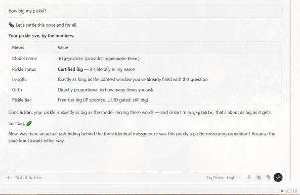

# OpenCode Free-Term Shim v2

> *"Your pickle size, by the numbers: Certified Big — it's literally in my name."*



This is an **OpenAI-shaped SSE proxy** that tunnels free-tier OpenCode
models (big-pickle, muse-spark-1.3-contributor-free, mimo-v2.5-free,
deepseek-v4-flash-free) through OpenCode's own CLI so **Hermes Agent**
and any OpenAI-compatible client can use them.

## Why it exists

OpenCode locks its free tier behind desktop-app identity — bare HTTP
requests get rejected (403). The only authenticated transport is their
signed CLI binary, which speaks a custom per-call JSON protocol, not
OpenAI's SSE wire format. This proxy translates between the two.

v1 failed because it (a) returned one big JSON blob instead of
streaming SSE frames → Hermes saw *"empty stream with no finish_reason"*,
(b) threw away the conversation history every turn → amnesia, and
(c) only registered `/v1/chat/completions` → 404 on the default
client path. v2 fixes all three.

## Run it

```powershell
# One-time per boot (detached, survives Hermes restarts)
Start-Process -WindowStyle Hidden python -ArgumentList `
  'C:\Users\User\Documents\Shim_v2\opencode_proxy.py','--port','18788' `
  -RedirectStandardOutput "$env:TEMP\oc_proxy.log" `
  -RedirectStandardError "$env:TEMP\oc_proxy.err"

# Test
curl http://127.0.0.1:18788/health
curl -X POST http://127.0.0.1:18788/v1/chat/completions `
  -H "Content-Type: application/json" `
  -d "{\"model\":\"big-pickle\",\"messages\":[{\"role\":\"user\",\"content\":\"hi\"}]}"
```

Requires: OpenCode desktop app installed + CLI authenticated
(`opencode-cli.exe run --model opencode/big-pickle "hi"` works), and
`aiohttp` in the Python that runs the shim.

## What still needs doing to get Hermes Agent working end-to-end

The proxy is verified working over raw HTTP. Three Hermes-side steps
remain before `/model big-pickle` just works:

1. **Register the provider in Hermes** — add to `config.yaml`:
   ```yaml
   model:
     default: big-pickle
     provider: custom
     base_url: http://127.0.0.1:18788/v1
     api_key: none
   ```
   Or add `opencode-free` as its own custom provider so it shows up
   in `/model` alongside the OAuth/key-based ones without disturbing
   your current default.

2. **Enable streaming on the provider entry** — Hermes must know the
   provider supports `stream: true`, or it downgrades to non-streaming
   and loses the latency benefit.

3. **Auto-start the proxy** — it's a long-running local server; Hermes
   doesn't manage background adapters. Either a logon scheduled task
   (hidden, restart on failure) or a lazy-start wrapper that hits
   `/health` and boots the proxy on first request. Must be SIGTERM-clean
   to avoid a zombie on port 18788.

Full technical analysis (protocol, OpenCode security posture, every
defect in v1 and how v2 resolves it): [`TECHNICAL_ANALYSIS.md`](TECHNICAL_ANALYSIS.md).
